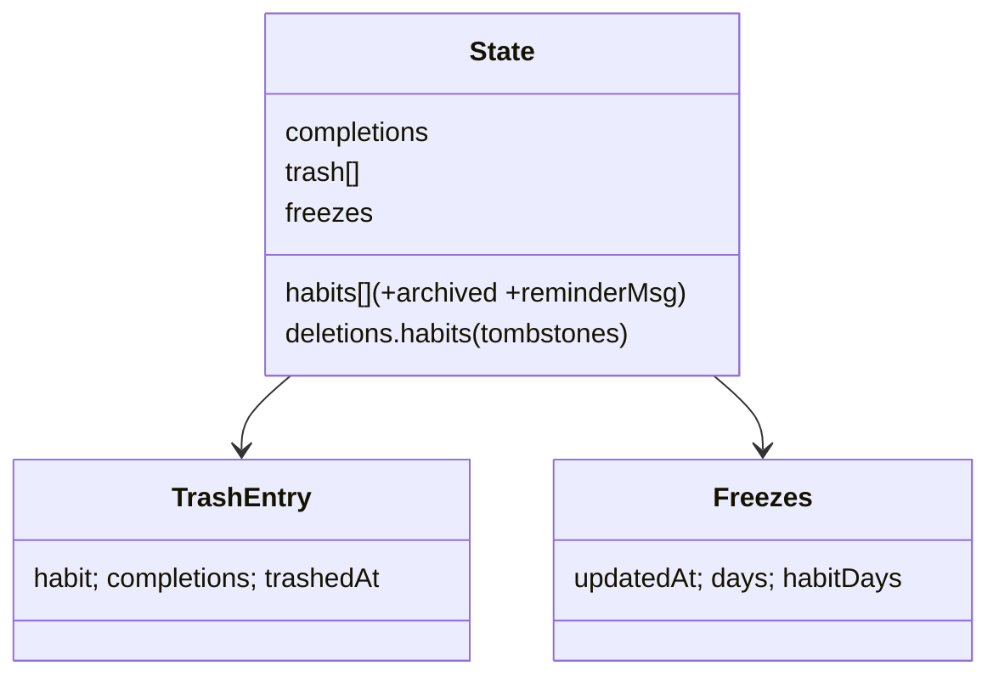

# Design — habit-management-enhancements

## Overview
Nine enhancements to Momentum (static PWA, single `app.js` IIFE, `localStorage` state, Gist sync with id-keyed merge + `updatedAt` last-write-wins + `deletions.habits` tombstones, background push via `buildPushSchedule` → Cloudflare Worker). No new frameworks; offline-first; every new field is normalized in `normalizeState` and merged in `mergeStates`.

## Data model changes

New habit fields:
- `archived: boolean` — paused; excluded from Today, reminders, push, adherence; history kept.
- `reminderMsg: string` (≤120 chars) — custom notification body.

New state structures:
- `trash: [{ habit, completions: {dateKey: value}, trashedAt }]` — recoverable deleted habits (full definition + its check-in snapshot). Auto-purged after 7 days.
- `freezes: { updatedAt, days: { "YYYY-MM-DD": true }, habitDays: { "<habitId>|YYYY-MM-DD": true } }` — global + per-habit streak-freeze days.

New `KEYS` (localStorage, device-local prefs):
- `timeFormat: "ht_time_format"` — `"12"` | `"24"` (default `"12"`).
- `onboardSeen: "ht_onboard_seen"`.
- `lastBackup: "ht_last_backup"` — ISO timestamp for the backup-reminder interval (~21 days).

### normalizeState / mergeStates
- `archived`, `reminderMsg` normalized on each habit; merged with habit's `updatedAt` LWW (already the rule).
- `trash`: normalize to array of valid `{habit, completions, trashedAt}`; merge = union by `habit.id`, newest `trashedAt` wins; drop any trash entry whose id has a newer tombstone.
- `freezes`: normalize the two maps; merge newest-`updatedAt`-wins for the whole object (simple + safe).
- Auto-purge trash (>7 days) runs on load after normalize; purged ids get a tombstone.

## Feature designs

1. **Archive** — add `isActiveHabit(h) = !h.archived && !inTrash(h)`. Filter at: `renderToday` (`scheduled`/`nightHabits`), `scheduleReminders`/`buildPushSchedule`, adherence/report aggregations, `renderHabits` (Active vs Archived filter tabs). Habit modal + row menu get Archive/Unarchive. Archived habits still reachable for the detail view.

2. **Trash/undo-delete** — replace `deleteHabitById` behavior: move habit + its completions into `state.trash`, remove from `state.habits`, strip its completion entries (kept in snapshot). New "Trash" card (Settings or Habits filter) lists entries with "restores in N days", Restore, Delete forever. Restore: re-add habit with `updatedAt = max(now, tombstone+1)`, re-merge completions, remove trash entry. Permanent delete / auto-purge: write tombstone. `mergeStates` handles trash union + tombstone-wins.

3. **Streak freeze** — `currentStreak` walks back over scheduled days: completed → count; frozen (and not completed) → skip (neither counts nor breaks); otherwise → stop. `isFrozen(habitId, date)` checks both maps. Adherence helpers exclude frozen scheduled days from the denominator. UI: a "freeze" toggle in the per-habit detail / day cell; history cells get a `.frozen` style. Merge newest-wins.

4. **Adherence trend chart** — `renderAdherenceTrend()` in Report: compute weekly (last ~12 weeks) or monthly (last ~12 months) adherence over active, non-trashed habits, excluding freeze days; render an SVG polyline (reuse the trend-chart styling from Progress). Toggle weekly/monthly. Gaps (no scheduled) render as breaks, not 0%.

5. **Per-habit detail view** — reuse modal shell: `openHabitDetail(habit)` shows current + longest streak, completion rate (%), best/worst weekday (by completion rate), a mini history strip, and Edit/Archive/Delete actions. Longest streak: scan completions. Insufficient-data state when no scheduled history.

6. **First-run onboarding** — `maybeOnboard()` on boot: if `state.habits.length===0 && state.trash.length===0 && !onboardSeen`, show an onboarding modal — a few starter template chips (reuse `TEMPLATE_LIBRARY` sections) + optional default reminder time; "Add these" creates habits (applying the reminder time); "Skip" closes. Set `onboardSeen`.

7. **Backup/restore** — `exportBackup()` → download `momentum-backup-<date>.json` = `{ schemaVersion, appVersion, exportedAt, state }`. `importBackup(file)` → parse, validate has `state.habits` array → `normalizeState` → prompt Replace or Merge (`mergeStates`) → persist + re-render. Invalid → toast error, no change. Backup reminder: on boot, if `now - lastBackup > 21d` and habits exist, show a non-blocking banner. `exportBackup` sets `lastBackup`. Round-trip: export→import(replace) yields equivalent normalized state.

8. **Custom reminder message** — habit field `reminderMsg`. `fireGroupReminder` single-habit body and `buildPushSchedule` entry body prefer `reminderMsg` when set (falling back to notes/time default). Grouped push keeps per-habit lines. Modal input (maxlength 120). Rebuild push on save.

9. **12h/24h preference** — `timeFmt()` reads `KEYS.timeFormat`. Central formatter `fmtClockLabel(hhmm)` already converts to 12h; add 24h branch honoring the pref, and route `timeChipLabel`/other displays through it. Settings select (Appearance). On change → persist + re-render current view. Stored times stay `HH:MM`.

## Testing (extend `__momentumTest` + test/)
- `test/streak.test.js` — `currentStreak` with freeze days (skip not break; completed-freeze counts), adherence denominator excludes freeze.
- `test/trash.test.js` — delete→trash→restore restores habit+completions; permanent delete writes tombstone; merge: trash union + tombstone-wins; auto-purge after 7 days.
- `test/backup.test.js` — export→normalize→import(replace) round-trip equivalence; invalid file rejected.
- `test/format.test.js` — `fmtClockLabel` 12h vs 24h.
- Expose new pure helpers (`isFrozen`, `longestStreak`, `habitCompletionStats`, `purgeTrash`, `applyBackup`) via `__momentumTest`.

## Rollout
- Bump `version.js` each push (SW cache). No Worker code change required for archive/custom-message (they flow through `buildPushSchedule`); redeploy only if worker/ changes. Confirm `/health` after any worker deploy.

## Data-model diagram

